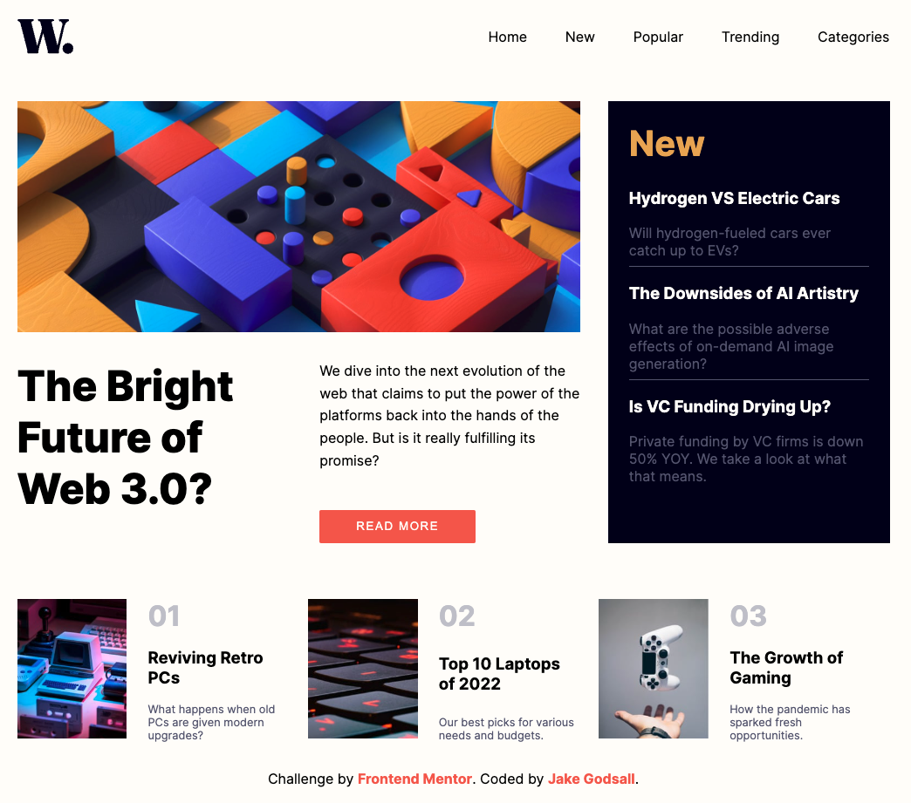

# Frontend Mentor - News homepage solution

This is a solution to the [News homepage challenge on Frontend Mentor](https://www.frontendmentor.io/challenges/news-homepage-H6SWTa1MFl). Frontend Mentor challenges help you improve your coding skills by building realistic projects. 

## Table of contents

- [Frontend Mentor - News homepage solution](#frontend-mentor---news-homepage-solution)
  - [Table of contents](#table-of-contents)
  - [Overview](#overview)
    - [The challenge](#the-challenge)
    - [Screenshot](#screenshot)
    - [Links](#links)
  - [My process](#my-process)
    - [Built with](#built-with)
    - [What I learned](#what-i-learned)
  - [Author](#author)

**Note: Delete this note and update the table of contents based on what sections you keep.**

## Overview

### The challenge

Users should be able to:

&#9745; View the optimal layout for the interface depending on their device's screen size
&#9745; See hover and focus states for all interactive elements on the page
&#9745; **Bonus**: Toggle the mobile menu (requires some JavaScript)

### Screenshot



### Links

- Live Site URL: [Netlify](https://jakegodsall-news-homepage.netlify.app/)

## My process

### Built with

- Semantic HTML5 markup
- CSS custom properties
- Flexbox
- CSS Grid
- SASS
- 7-1 SASS Architecture
- Vanilla JavaScript

### What I learned

- How to create a hamburger menu using pure CSS with `::before` and `::after` pseudo-elements.
- How to transition from the hamburger to a `X` symbol using CSS transforms.
- How to load different images according to the viewport width using media queries and the display property. For example

```css
.image1 {
  display: inline;
}

.image2 {
  display: none;
}

@media screen and (min-width: 450px) {
  .image1 {
    display: none;
  }

  .image2 {
    display: inline;
  }
}
```
- The importance of having a media query for tablet viewports and not only desktop and mobile.

## Author

- Website - [Jake Godsall](https://www.jakegodsall.com/)
- Frontend Mentor - [@jakegodsall](https://www.frontendmentor.io/profile/jakegodsall)
- LinkedIn - [@godsalljake](https://www.linkedin.com/in/godsalljake/)
  
